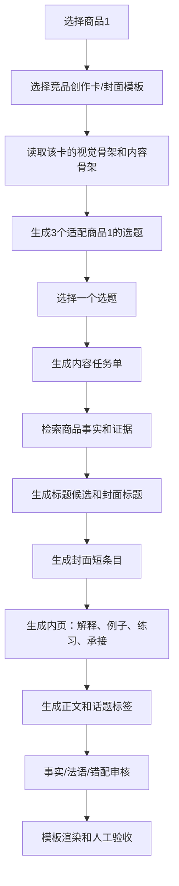

# 商品1小红书工作流交接文档

更新时间：2026-07-23

## 项目背景

用户在小红书电商售卖两个虚拟知识库商品，当前只继续商品1。

商品1是 `DELF B2 法语写作知识库`，本质不是普通知识库，而是售卖给备考用户的资料包。它包含范文、评分标准、句型库、词汇库、主题观点、错题对照、检查清单、考前速查等内容。

这个项目要做的不是一个普通 AI 文案工具，而是一个本地可运行的小红书带货笔记智能体。它要能根据商品内容、竞品爆款封面、标题公式、用户痛点，生成可发布的小红书笔记，包括：

- 笔记标题
- 封面标题
- 封面内容
- 内页内容
- 正文
- 话题标签
- 商品承接

用户的核心诉求是：少手搓，但产出要接近人工运营认真做出来的效果。

## 项目目的

最终不是为了“自动生成很多东西”，而是为了每天稳定产出不同的小红书笔记，服务两个目标：

1. 传播：让用户愿意点、愿意收藏、愿意转发。
2. 带货：让用户看完觉得这个知识库确实能解决自己备考里的具体问题。

所以判断标准不是接口是否成功，而是：

- 标题有没有点击欲
- 封面一眼能不能看懂
- 封面是不是像小红书高赞资料封面
- 内页有没有真实干货
- 正文有没有真人感
- 商品植入是不是自然
- 内容和商品能力是否匹配
- 有没有错字、法语错误、常识错误
- 有没有小红书关键词和话题标签

## 用户的真实审美/运营要求

用户对质量非常敏感，尤其讨厌以下情况：

- 封面像程序员随便用 HTML 拼出来
- 字体廉价，比如全是默认黑体/宋体/楷体
- 字太小，小红书信息流里看不清
- 字太大，遮住内容或显得粗糙
- 文字、线条、圆点不对齐
- 信息密度不够，看起来不像资料包
- 参考图只是“口头模仿”，结果完全不像
- 标题很平，比如“知识点一页理清”
- 正文 AI 味重，比如空话、套话、解释设计意图
- 封面和标题错配，比如情绪化标题配大量表格型封面
- 商品能力支撑不了标题承诺

用户可以接受：

- 知识分享型笔记，不一定每篇都强带货
- 真人经验型笔记
- 商品知识库展示型笔记
- 科普内容由 AI 生成，但不能假装是商品独有内容
- 用竞品封面做强参考，但不能复制对方文字、logo、水印、独有元素

## 我的核心判断

早期方案最大问题是：参数太多，链路太“技术”，不像真人运营做笔记。

真人手搓时通常不是这样：

“随机抽一个痛点 + 随机抽一个买点 + 随机抽一个标题 + 随机抽一个封面”

而是这样：

看到一张竞品高赞封面，比如“羊皮纸语法体系大目录”，然后想：

“我能不能基于我的商品，做一篇面向 DELF B2 写作考生的 B2 写作知识体系？”

再进一步想：

- 这篇给谁看？
- 他现在痛在哪里？
- 我的资料包能解决哪一部分？
- 封面上应该展示什么短内容？
- 内页展开哪些解释？
- 标题用恐惧、好奇、反常识还是清单？

所以现在的工作流应该模拟这个过程。

## 当前设计思想

核心设计：以“竞品创作卡”为入口，反向生成适合商品1的笔记。

不是标题先行，也不是知识点先行，而是：

`参考图/竞品卡 -> 内容任务单 -> 商品证据 -> 标题/封面/内页/正文`

原因：

封面模板不是万能容器。不同模板天然要求不同内容形态：

- 羊皮纸大目录：适合体系、清单、知识结构
- 白底绿字语法清单：适合语法体系、词类、规则
- 文档解析：适合范文、题目、素材拆解
- 黑板短语表：适合短语、句型、表达
- 备忘录：适合课程说明、资料说明、经验总结
- 手写批改：适合作文错误、改写、扣分点
- 真人实拍：适合经验、学习现场、备考状态
- 教材封面风/词汇表压屏：更适合图生图，不适合纯 CSS

如果先随便定标题，再随便匹配封面，就一定会错配。

## 关键设计原则

### 1. 封面模板决定内容形态

用户可以先选封面模板或竞品卡，系统再反向生成适配它的内容。

例如：

如果选“羊皮纸语法体系大目录”，内容就必须是体系型：

- B2写作知识体系
- 正式信格式体系
- 连接词体系
- 检查清单体系

不能生成：

- 情绪口播经验
- 单一故事
- 考前倒计时
- TEF/TCF选择

### 2. 封面只放短条目

封面不是正文页。

封面应该放：

- 短词
- 短句
- 分类名
- 错误点
- 高频表达
- 可扫读的清单

长解释、完整句子、复杂法语分析，要放内页。

这条是目前最重要的视觉稳定规则。

### 3. 标题分两种

必须区分：

1. 笔记标题：发小红书时显示在信息流/搜索里的标题，可以更有情绪、更像爆款。
2. 封面标题：放在图片上的大字，必须短、清楚、能和模板结构配合。

例如：

笔记标题：

`法语B2写作越学越乱？先分清这几类`

封面标题：

`DELF B2写作知识体系`

不能强行让同一个标题同时承担两种任务。

### 4. 商品证据优先，但允许科普扩展

商品知识库里有的内容，优先从商品事实中取。

但如果是通用科普，比如“法语学习路径”“B2写作常见问题”，可以让 AI 补充。

边界：

- 可以作为科普
- 不能说成商品独有
- 不能生成和商品能力冲突的承诺

### 5. 爆款标题库不是硬套

用户给了 75 个爆款标题公式。

正确用法不是机械套模板，而是：

- AI 先理解本篇内容任务
- 再从标题公式中挑 2-4 个最适合的
- 仿写成自然中文
- 再检查是否像人话

如果硬套，就会出现：

`法语B2写作：3档路径里，先选对这一档`

这种不通顺标题。

标题必须做二次润色，而不是模板填空。

## 当前工作流应该长这样

## 内容任务单是什么

内容任务单是后续所有生成的“总纲”，避免标题、正文、封面各写各的。

它应该包含：

- 商品：商品1
- 参考卡：例如羊皮纸大目录
- 内容意图：体系/清单/解析/经验/避坑/资料展示
- 目标人群：例如 DELF B2 写作考生、写完不会改的人、背了句型不会用的人
- 真实痛点：例如写作没结构、不会自查、连接词贫乏、正式信格式混乱
- 商品承接点：例如句型库、检查清单、范文库、错题库
- 封面内容形态：短条目/分组清单/表格/大字痛点/文档截图感
- 内页任务：解释、例子、对比、练习、商品展示
- 禁止事项：不能承诺7天提分、不能写商品没有的听力资料等

这个任务单比“痛点/买点/人群”三个孤立参数更稳定。

## 为什么不继续无限加参数

之前复杂的原因不是参数少，而是参数之间缺少“主线”。

痛点、人群、买点、卖点都重要，但不能让它们独立随机组合。

正确关系应该是：

`竞品卡/模板 -> 内容任务单 -> 人群/痛点/买点/证据 -> 标题/封面/内页/正文`

也就是说，人群、痛点、买点不是被删除，而是被装进任务单里，由任务单统一约束。

## 当前最大风险

### 风险1：封面模板和内容不匹配

解决：

模板先行或竞品卡先行，反向生成内容。

### 风险2：封面塞太多字

解决：

短条目进封面，长解释转内页。

### 风险3：标题看起来用了模板但没爆点

解决：

标题公式只做候选，不做最终答案。AI 必须仿写、润色、筛选。

### 风险4：知识库证据太少导致每天内容重复

解决：

允许三种内容来源：

1. 商品证据内容
2. 商品证据 + AI科普扩展
3. 纯科普引流 + 商品自然承接

但每篇必须标记来源类型，避免把通用科普包装成商品独有。

### 风险5：模板视觉不够像竞品

解决：

代码模板只做适合代码精排的类型，比如羊皮纸、白底清单、文档解析。

图生图适合：

- 真人经验
- 教材封面风
- 主题词汇表压屏
- 手写批改
- 实拍学习桌

不要用 CSS 硬模仿所有图。

### 风险6：API 成本和速度

一次笔记目前可能 3-5 分钟，token 约 1.3w-1.9w。

后续优化方向：

- 竞品卡预分析，不要每次重分析
- 商品事实预索引，不要全量塞给 AI
- 标题候选轻量生成
- 封面内容和内页生成可拆成小模型/缓存
- 图生图只在需要时使用

## 设计上哪些是确定的

- 商品1可以继续打磨验收。
- 商品2还没完整接入，不要误报。
- 竞品创作卡路线是对的。
- 封面模板必须和内容任务绑定。
- 标题和封面标题必须分开。
- 封面短条目、内页长解释是对的。
- 商品知识库证据优先，但科普扩展允许。
- 纯 CSS 不适合所有模板，图生图要分流。

## 设计上哪些还没完全解决

- 爆款标题生成仍不够稳定。
- 字体审美还不够好。
- 多个模板仍有错位、遮字、大小不适的问题。
- 图生图模板还没有完全接入主流程。
- 正文长度和小红书话题标签还需更强约束。
- 每日批量生成时的去重机制还需要加强。

## 当前目标

继续打磨商品1：`DELF B2 法语写作知识库` 的小红书带货笔记生成工作流。

目标不是“代码跑通”而是：能稳定生成有传播力、带货感、干货感的小红书笔记，并且封面不乱、不遮字、不错配。

## 商品1数据源

商品1知识库原始目录：

`D:\claude_work\xunixiangmu\deliverables\feishu_pages`

商品1结构化事实文件：

`D:\claude_work\xunixiangmu\deliverables\product_facts.json`

这个文件已可被工作流读取，包含商品知识片段、证据、来源文件等。

## 当前项目位置

前端/后端项目：

`D:\claude_work\waiyuxhssop\xhs-workbench`

本地页面：

`http://localhost:4000/`（小红书笔记台，主流程）

模板矩阵：

`http://localhost:4000/template-matrix`

旧入口 `/reference-studio` 会自动跳转到首页。旧审核台、规划台、视觉库、生图链路、零散 test 页已移除。

## 已经形成的新方案

现在不是“先随机生成标题再套封面”，而是更接近手搓逻辑：

1. 先选一个竞品创作卡/参考封面。
2. 系统知道这个参考图的内容骨架和视觉骨架。
3. AI 根据商品1、目标用户、痛点、卖点、参考图，迁移出适合商品1的新选题。
4. 选题确定后，再生成标题、封面标题、封面短条目、内页、正文和标签。
5. 封面只放短条目，长解释转到内页，避免硬塞导致错位。
6. 视觉模板由代码固定排版；实拍、黑板、教材封面、词汇表压屏等可走图生图或混合方案。

核心原则：

- 封面模板不能随便匹配标题。
- 标题承诺不能超过商品能力。
- 封面条目必须短、准、能看懂。
- 内页负责解释，封面负责点击。
- 知识库里有的内容优先用证据；纯科普内容允许 AI 补，但不能伪装成商品独有资料。

## 已开发的主要链路

主接口：

`src/app/api/reference-studio/route.ts`

这个接口目前会做：

- 读取商品1知识事实
- 根据竞品卡生成 migrated topics
- 检索商品证据
- 生成标题候选
- 生成封面 payload
- 生成内页 payload
- 生成正文和话题标签
- 做基础审核/返修
- 输出 token usage

前端页面：

`src/app/page.tsx`（小红书笔记台）

模板渲染入口：

`src/components/templates/ReferenceCoverRenderer.tsx`

羊皮纸大目录独立组件：

`src/components/templates/ParchmentDenseCover.tsx`

模板规格：

`src/lib/cover-template-specs.ts`

竞品卡到模板映射：

`src/lib/creative-card-library.ts`

## 已经做过的关键修复

### 1. 标题候选逻辑

文件：

`src/app/api/reference-studio/route.ts`

已调整 `ensureTitleCandidateMix()`：

- 优先使用爆款公式标题
- 其次使用参考图迁移标题
- 最后才用自由标题

之前问题：

标题容易退化成 `法语B2写作知识点，一页理清` 这种平淡标题。

现在测试中已出现更接近可用的标题：

`法语B2写作越学越乱？先分清这几类`

但标题仍需要继续打磨，不要只套 “xxx？yyy”。

### 2. 内页标题兜底

文件：

`src/app/api/reference-studio/route.ts`

新增：

`normalizeInnerPageTitle()`

解决接口返修后仍失败：

`inner_page_title_invalid`

### 3. 黑板短语表密度下调

文件：

`src/lib/cover-template-specs.ts`

`blackboard_phrase` 从：

`itemsPerSection: 10, minTotalItems: 18`

改为：

`itemsPerSection: 8, minTotalItems: 15`

原因：

黑板封面如果硬塞太多，字会太小；封面应该看起来密，但不能不可读。

### 4. 文档解析/备忘录/三列搭配样式微调

文件：

`src/components/templates/ReferenceCoverRenderer.tsx`

已追加样式覆盖：

- `rc-memo`
- `rc-doc-frame`
- `rc-collocation`

目的：

- 备忘录更像备忘录
- 文档解析正文别太小
- 三列搭配减少错位和溢出

这些还不是最终高质量，只是阶段性修补。

### 5. 羊皮纸模板字号修过

文件：

`src/components/templates/ParchmentDenseCover.tsx`

已做：

- 标题字号降低
- header 高度固定
- 防止标题过大遮住正文

但仍有一个重要待修：

封面标题数字承诺要和实际条目数一致。

例如测试出现：

封面标题：`法语正式信开头结尾常用20句`

实际条目数：16

这必须修。

## 已通过的真实 API 测试

注意：这些测试消耗 DeepSeek API token，不要无限跑。

测试脚本：

`scripts/smoke-reference-workflow.mjs`

运行示例：

`node scripts\smoke-reference-workflow.mjs resource_04_chalkboard_phrase_list`

已经跑过：

### resource_11_delf_doc_analysis

状态：成功

审核：approved

token：约 13,233，3 calls

### resource_02_grammar_white_green

状态：成功

审核：approved

token：约 17,878，4 calls

### resource_04_chalkboard_phrase_list

第一次失败：

`cover_section_capacity_invalid`

`cover_density_too_low`

修规格后成功。

成功结果里仍有问题：

- 标题有进步
- cover title 数字承诺和实际条目数不一致
- 需继续修

最新成功输出要点：

- 选题：`DELF B2写作：正式信开头结尾常用12句`
- 标题：`法语B2写作越学越乱？先分清这几类`
- 封面：`法语正式信开头结尾常用20句`
- 实际条目：16
- tags：有 `#法语学习 #DELFB2 #法语写作 #正式信模板 #DELFB2写作 #DELFB2备考`
- audit：approved true
- corrected_count：3
- token：约 19,189，4 calls

## 当前最优先要做

### P0：修数字承诺不一致

位置：

`src/app/api/reference-studio/route.ts`

函数：

`ensureCoverIdentity()`

建议逻辑：

1. 计算封面实际 item 数：

`sections.reduce((sum, section) => sum + section.items.length, 0)`

2. 如果 `cover.title` 或 `cover.subtitle` 出现 `20句/25个/30条/36项` 这种数字，并且明显大于实际条目数，就改成实际条目数。

3. 或者更稳：封面标题不要写具体数字，改成：

`法语正式信开头结尾常用句`

但小红书点击感会弱一点。

推荐：

小数字可以保留，必须和实际一致。

### P0：继续跑商品1 3个模板

修完数字后，至少跑：

`resource_04_chalkboard_phrase_list`

`resource_06_notes_course_offer`

`resource_14_collocation_dense_green`

每个看：

- 标题是否像人话
- 是否带法语/DELF B2/写作等身份
- 封面标题和条目是否一致
- 封面条目是否过长
- 正文是否太长
- 是否有关键词和 `#`
- audit 是否 approved

### P1：正文长度控制

用户明确反馈正文太长。

小红书正文建议：

- 干货/资料型：300-600 字
- 经验型：500-900 字
- 带货笔记不要写成说明书

当前正文有时 300+，有时偏长，要让 AI 输出：

- 开头 2-3 行有钩子
- 中间给干货
- 末尾自然承接商品
- 必须带关键词
- 必须带 5-8 个 `#`

### P1：封面短条目规则继续强化

封面不要放：

- 长解释
- 半截法语
- 太复杂语法解释
- 用户看不懂的缩写

封面应该放：

- 短词
- 短句
- 类目名
- 错误点
- 可直接扫读的表达

长内容进入内页。

### P1：模板矩阵视觉质量还没全过

用户已指出很多模板问题：

- 羊皮纸：仍可能遮字、颜色层级不够
- 黑板短语表：信息密度和字号平衡
- 黑板课程招募：楷体感太重
- 白底紫色语法资料：颜色和字体层级没审美
- 备忘录课程说明页：不像苹果备忘录，需要样式更强
- 疑问词大字卡片：字体太普通
- 手写本警告首图：建议图生图，不要硬 CSS
- DELF素材文档解析：下面字仍可能偏小
- 白底绿字语法清单：标题和内容字号接近，不够好看
- 教材封面风、主题词汇表压屏：不适合纯 CSS，应该图生图

注意：用户已经明确不能接受“只是 HTML 堆文字”。

## 当前策略建议

不要继续无限新增模板。

先把商品1主链路跑通，限定 3-5 个能用模板：

1. 羊皮纸语法体系大目录
2. 白底绿字语法清单
3. 文档素材解析
4. 黑板短语密集表
5. 备忘录说明/三列搭配二选一

先保证这几个稳定能发，再扩展。

## 生图/API状态

用户提供过 zexapi key，并要求改成：

`https://zexapi.com`

模型：`gpt-image-2` / image2

但当前不要在交接后立刻乱跑图，除非明确需要。

目前优先：减少 API 调用，把已有流程和代码模板打稳。

## 用户偏好和注意事项

用户非常在意：

- 结果像不像小红书
- 封面是不是好看
- 是否错位、遮字、字体廉价
- 标题是否有爆款感
- 内容是否像真人
- 是否带货但不硬广

用户不能接受：

- “开发完成”但没自测
- AI 味文案
- 只写设计意图给用户看
- 封面模板和内容错配
- 参考图只是口头模仿，结果完全不像
- 字小到小红书封面看不清

回复用户要简洁，但做事要严格。

## 下一位 AI 接手步骤

1. 进入目录：

`D:\claude_work\waiyuxhssop\xhs-workbench`

2. 先读：

`src/app/api/reference-studio/route.ts`

`src/lib/cover-template-specs.ts`

`src/components/templates/ReferenceCoverRenderer.tsx`

`src/components/templates/ParchmentDenseCover.tsx`

`scripts/smoke-reference-workflow.mjs`

3. 先修 `ensureCoverIdentity()` 的数字承诺问题。

4. 跑 build：

`npm.cmd run build`

5. 跑商品1 smoke：

`node scripts\smoke-reference-workflow.mjs resource_04_chalkboard_phrase_list`

6. 再跑：

`node scripts\smoke-reference-workflow.mjs resource_06_notes_course_offer resource_14_collocation_dense_green`

7. 把输出结果按“能不能发小红书”判断，而不是只看 success。

8. 给用户汇报时不要说全搞定，除非至少 3 个模板真实跑通且视觉没有明显遮字/错位。

## 当前未完成事项清单

- [ ] 商品1封面标题数字和实际条目数一致
- [ ] 商品1至少 3 个模板真实 API 跑通
- [ ] 每个结果检查标题、封面、内页、正文、标签
- [ ] 正文长度控制到小红书可发范围
- [ ] 封面短条目规则彻底落地
- [ ] 模板矩阵视觉继续做人工级审美打磨
- [ ] 图生图模板和代码模板明确分流
- [ ] 商品2尚未完整接入，不要误报完成
